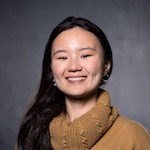
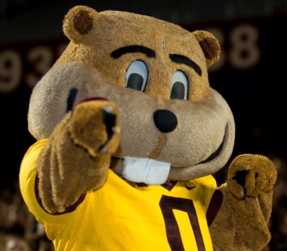
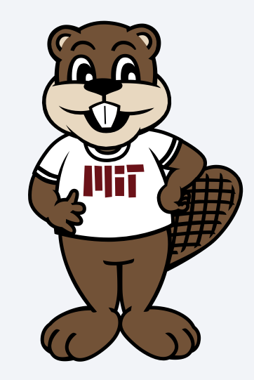

--- 
layout: collection
entries_layout: grid
title: Members
permalink: /Members/
# Header
header:
    overlay_color: "#000"
    overlay_filter: "0.5"
    overlay_image: "assets/images/IMG_5100.jpg" 

---

### Current Mmebers

{: .align-left width="100" }
[Rui Cheng](https://ruillercoaster.github.io)     
Lab PI    
 
  
{: .align-left  width="100"}
Emily Anderson  
Undergraduate Researcher  
UMN Physics  

{: .align-left  width="100"}
Daanish Hindustani  
Undergraduate Researcher  
UMN Computer Science  

{: .align-left  width="100"}
Varadaraya Ganesh Shenoy  
Undergraduate Researcher  
UMN Computer Science  

{: .align-left  width="100"}
Baanee Singh  
Undergraduate Researcher  
UMN Computer Science  

<!-- 
{: .align-left  width="100"} 
Robert Hairston  
Robotics MS
{: .align-left  width="100"}
Helenrose Jorgensen  
Robotics MS -->

### Alumni

{: .align-left  width="100"} 
Lily Smith  
Undergraduate Researcher  
MIT CEE  

